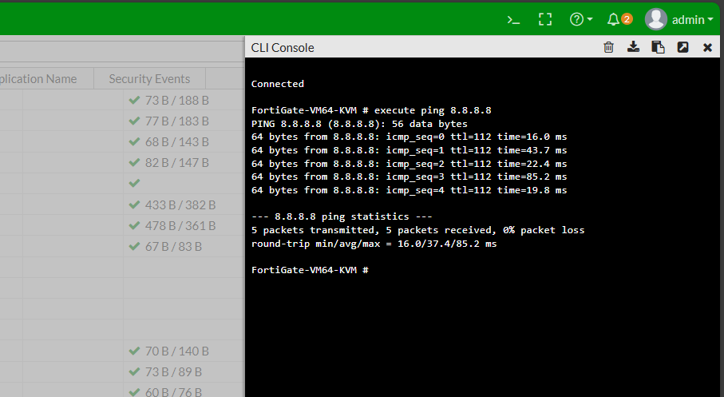
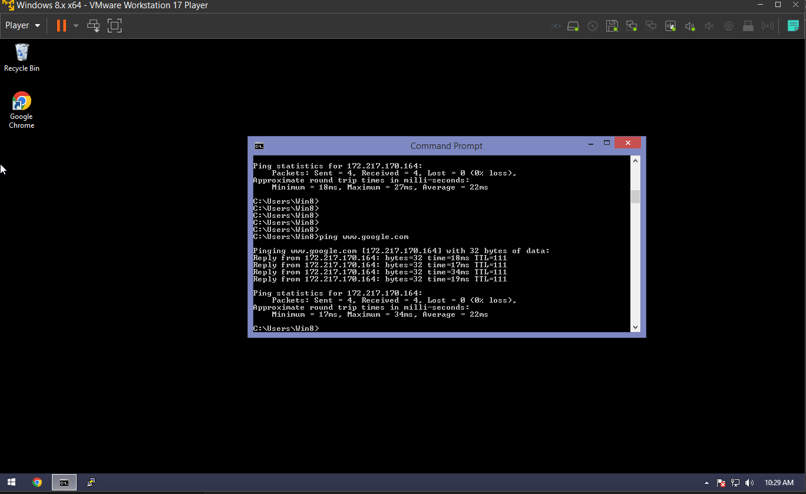

# DUAL-ISP Failover with Policy NAT

- The topology is to demostrate Failover when the border router is connected to two ISPs for redundancy.
- In order to track the status of the main ISP connectivity, IPSLA with object tracking is used.
- Ff tracking goes down, routing switches automatically to backup ISP connection, until the main connection is re-established.
- The router does this with the help of Policy NAT using route maps mapping to tracking, ISP-facing interfaces, and subnets to be NATed.
- Fortigate firewall is used to protect the LAN using Zone-based policy firewall.

---

## Quick Overview

- **Routing:** OSPF (with static route redistribution)
- **Security:** Zone-Based Firewall, Policy NAT
- **Monitoring:** IPSLA with Object tracking

---

## Configuration on Cisco Router Policy NAT

---

## Verification on Fortigate

----

## Verification on End-User PC
