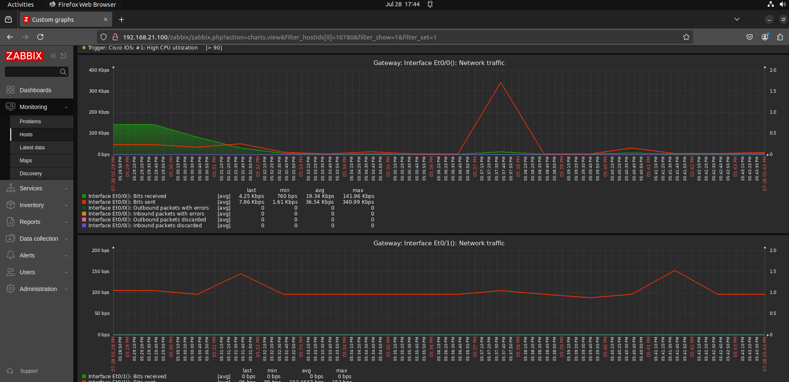
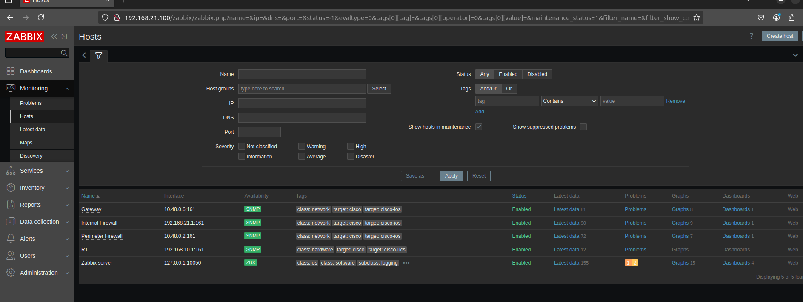

# DUAL-ISP Failover with Policy NAT

- The topology is to demostrate Failover when the border router is connected to two ISPs for redundancy.
- In order to track the status of the main ISP connectivity, IPSLA with object tracking is used.
- If tracking goes down, routing switches automatically to backup ISP connection, until the main connection is re-established.
- The router does this with the help of Policy NAT using route maps mapping to tracking, ISP-facing interfaces, and subnets to be NATed.
- Zabbix server is used to monitor all network devices.
- The internal DNS resolves internanal domain names and also fowards external DNS resolution requests.


---


## Quick Overview

- **Routing:** OSPF (with static route redistribution)
- **Security:** Zone-Based Firewall, Policy NAT
- **Monitoring:** IPSLA with Object tracking, Zabbix monitoring server.

---

## Configuration on Cisco Router Policy NAT

```bash

ip nat inside source route-map ISP-1 interface Ethernet0/2 overload
ip nat inside source route-map ISP-2 interface Ethernet0/3 overload
ip route 0.0.0.0 0.0.0.0 Ethernet0/2 44.67.28.1 track 1
ip route 0.0.0.0 0.0.0.0 Ethernet0/3 72.73.74.1 10
ip ssh version 2
!
ip access-list extended NAT-ACL
 permit ip 192.168.8.0 0.0.7.255 any
 permit ip 192.168.21.0 0.0.0.255 any
 permit ip host 10.21.0.2 any
!
ip sla 1
 icmp-echo 44.67.28.1 source-interface Ethernet0/2
 frequency 10
ip sla schedule 1 life forever start-time now
ip sla 2
 icmp-echo 72.73.74.1 source-interface Ethernet0/3
 frequency 10
ip sla schedule 2 life forever start-time now
 ```

---

## Verification the Gateway Router
```bash
GATEWAY-ROUTER#sh ip route ospf

Gateway of last resort is 44.67.28.1 to network 0.0.0.0

      10.0.0.0/8 is variably subnetted, 4 subnets, 2 masks
O IA     10.21.0.0/30 [110/30000] via 10.48.0.5, 00:11:07, Ethernet0/0
O        10.48.0.0/30 [110/20000] via 10.48.0.5, 00:11:43, Ethernet0/0
O IA  192.168.8.0/21 [110/30100] via 10.48.0.5, 00:10:27, Ethernet0/0
O IA  192.168.21.0/24 [110/40000] via 10.48.0.5, 00:11:07, Ethernet0/0
GATEWAY-ROUTER#

```

----

## Monitoring on Zabbix server



